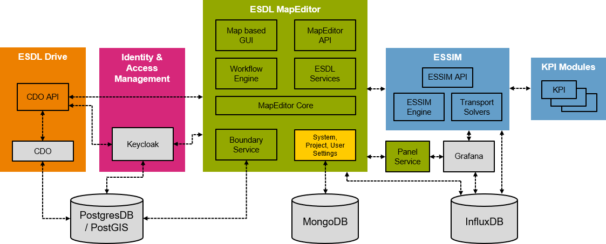

# ESDL MapEditor and ESSIM

This project contains all information necesarry to run the ESDL MapEditor and ESSIM toolsuite on Azure Kubernetes Services.

## Contents

- [ESDL MapEditor and ESSIM](#esdl-mapeditor-and-essim)
  - [Contents](#contents)
  - [What can I do with the MapEditor and ESSIM?](#what-can-i-do-with-the-mapeditor-and-essim)
  - [What is ESDL?](#what-is-esdl)
  - [Features](#features)
    - [ESDL MapEditor Features](#esdl-mapeditor-features)
    - [ESSIM Features](#essim-features)
  - [The architecture of the Toolsuite](#the-architecture-of-the-toolsuite)
    - [Prerequisites](#prerequisites)
	- [Steps to follow](#steps-to-follow)
    - [Step 1. Modifying the Kubernetes files](#step-1-modifying-the-kubernetes-files)
    - [Step 2. Log in to the ESDL MapEditor](#step-2-log-in-to-the-esdl-mapeditor)
    - [Step 3. Upload some profiles](#step-3-upload-some-profiles)
  - [ESDL MapEditor and ESSIM Tutorials](#esdl-mapeditor-and-essim-tutorials)
  - [License](#license)

## What can I do with the MapEditor and ESSIM?

The ESDL MapEditor is a map based energy system editor. You can use it to create ESDL based energy system descriptions, that can then be simulated with a growing number of ESDL capable simulators.
ESSIM is our ESDL based energy system simulator that gives insights in the hourly energy (im)balance of an energy system described in the ESDL language.


To get an impression of what the tools can do and how they look like, have look at the [tutorials](https://github.com/ESDLMapEditorESSIM/essim-tutorials).

## What is ESDL?

ESDL is a modelling language created to describe complete (hybrid) energy systems in one uniform format. It allows to describe information about the individual energy system components, how they are connected, how they are used (e.g. using energy production or consumption profiles), where they are physically located (on the map), what they cost (now and in future). Furthermore information about buildings in an area, energy potential, KPIs (on buildings, areas, or any assets) can be described. Possible applications are facilitating interoperability between different energy transition models and publishing open data on energy systems.

Click [here](https://energytransition.gitbook.io/esdl/) for the ESDL documentation website

Click [here](https://energytransition.github.io/) for the ESDL class documentation website (a clickable ESDL model)

Click [here](https://github.com/EnergyTransition/ESDL) for the ESDL github website

## Features

### ESDL MapEditor Features

- Draw an energy system scenario by dragging and dropping energy assets on a map
- Connect components, set typical component characteristics (installed power, efficiencies, costs)
- Attach power or energy profiles to assets (demand and production profiles)
- Set control strategies (specifically needed for ESSIM simulations)
- Query external ESDL data sources, for example for solar or wind potential
- Visualize WMS layers with information that can be used to define your scenario
- Convert shapefiles into ESDL assets
- Query the boundary service for area borders (provinces, municipalities)
- Visualize results of simulations on the map (KPI dashboards, load animations, color areas based on KPI outcomes, load duration curves)

Click [here](https://energytransition.gitbook.io/esdl/esdl-based-tools/mapeditor) for some more information on the ESDL MapEditor

### ESSIM Features

- Simulates energy systems defined in ESDL and calculates energy balance over time
- Calculates optimal schedule of flexible producers and the effect of this schedule in terms of emissions, costs, load on the network
- Calculates schedules for conversion and storage in a similar manner

Click [here](https://energytransition.gitbook.io/esdl/esdl-based-tools/essim) for some more information on ESSIM

## The architecture of the Toolsuite

The architecture of the toolsuite provided is shown here (the gray components are open source solutions provided by others):


It consists of the following functionalities:

- ESDL MapEditor: map based scenario editor
- ESSIM: energy system simulator, to calculate hourly energy balance and give insights in effects of conversion and storage
- Identity & Access Management: using keycloak, an open-source IAM solution, it provides user management, roles, groups, organisations, authentication and authorisation, role based access control
- ESDL Drive: cloud storage for ESDL files, with access control at user, group or organisation level (supports versioning in the near future)
- Panel Service: service to create graphs from influxdb time series
- Boundary Service: service that gives boundary information for provinces, municipalities, neighbourhoods, and so on
- Grafana: open-source analytics & monitoring solution for every database
- InfluxDB: open-source time series database solution
- PostgresDB with PostGIS extension: open-source relational database management system
- MongoDB: open-source document-oriented database program (NoSQL)

The architecture of this Kubernetes implementation:


Traefik was added as an Ingress Controller to terminate SSL traefik and make environment securely reachable from the outside.

### Prerequisites

The current stack uses the following tools:
- A kubernetes cluster (In this case Azure Kubernetes Services, with little alteration it should work on minikube too.)
- kubectl (logged in to the cluster)
- helm and the [Traefik Helm Chart Helm-repository](https://github.com/traefik/traefik-helm-chart#installing)
- bash (If you have Windows you can attempt to translate the scripts into powershell or run the scripts on WSL)
- curl

The rest of the tools come preinstalled on most Linux distributions. If not, look at the setup.sh script and make sure the tools used there are installed. 

Recommended:
- A domain
- Domain names set up as shown in the Ingress Controller setup above.

> **_NOTE:_**  Macbook M1 users and users of the ARM64 architecture are experiencing difficulties when trying to install this software, because it is incompatible with the Intel x64 architecture we use on our servers and laptops. We are looking into creating multi-arch docker images but this is work in progress. For now: reach out to an Intel-based machine or VM to install this software.


### Steps to follow

- [Step 1. Modifying the Kubernetes files](#step-1-modifying-the-kubernetes-files)
- [Step 2. Log in to the ESDL MapEditor](#step-2-log-in-to-the-esdl-mapeditor)
- [Step 3. Upload some profiles](#step-3-upload-some-profiles)

### Step 1. Modifying the Kubernetes files

---
**NOTE FOR WINDOWS USERS:**

When cloning this repository using git for windows, file line endings are automatically converted from LF (Unix style) to CRLF (Windows style). This causes problems for the file BaseInfrastructure/postgres/init-database.sh as it is being mounted in one of the docker containers running linux. Please make sure that this file gets Unix style line endings, by converting it back using for example notepad++ or dos2unix, or configure git in such a way that it doesn't automatically convert line endings to windows style (Search for 'git autocrlf').

---
The files have to be edited to work depending on your specific setup. 

If you have a domain (easiest):
Modify traefik-values.yaml. Set the e-mail of the owner of the domain at `  - --certificatesresolvers.transip.acme.email=`. All you have to do now is to replace all occurences of domain.tld in every file with your domain.

Testing on localhost:
Remove traefik from the setup script. Replace all occurences of *.domain.tld (including the subdomain) with localhost and the respecting port of the service. Remove the ingress sections from the .yaml files. Replace all occurences of https with http.

If you don't have a domain (unsupported):
Similar to localhost, but instead of localhost use the public IP. The script might not work anymore. 

If you are using Azure Kubernetes Services:
In traefik-values.yaml, uncomment the following:
```yaml
# service:
#   annotations:
#     service.beta.kubernetes.io/azure-load-balancer-ipv4: x.x.x.x
```
Change the ipv4 address to the ipv4 address of the public ip in the Resource Group created by Azure Kubernetes Services.
Uncomment every occurence of `  # storageClassName: azurefile-csi` in the persistent volume claim files.

### Step 2. Log in to the ESDL MapEditor

Using your webbrowser go to `https://domain.tld`


Press `Start` and log in using the generated admin credentials.


You should see the following screen now:


### Step 3. Upload some profiles

If you're installing this toolsuite to run ESSIM simulations or any other application that requires timeseries data, you need to upload some profiles. For that purpose we've created a profile manager. In the repository there is an example dataset with profiles created from publically available data (NEDU profiles for electricity and gas usage and KNMI solar profile).

Click `View` and select `Settings` from the menu. The application settings dialog appears. Click `Upload profiles`. In the first drop down menu select:
- Personal profiles: to upload profiles that will become available only for the current user
- Standard profiles: to upload profiles that will become available for all users
- Project profiles for ...: to upload profiles related to a project, so that all project members can use these profiles


Drag the file `.\Data\Profiles\standard_profiles.csv` and drop it in the area indicated in the dialog. Depending on your local machine's regional settings (Use '.' or ',' as the decimal seperator) you might need to choose the other csv file in the same directory.


After the uploading is finished, click `Profiles plugin` in the menu on the left. On the right side a window appears where you can view and edit the settings of the profiles you've just uploaded.


The profiles can now be used in the simulations.

## ESDL MapEditor and ESSIM Tutorials

Please go [here](https://github.com/ESDLMapEditorESSIM/essim-tutorials) to find five different tutorials that explain how to work with the ESDL MapEditor and ESSIM

## License

MapEditor and ESSIM are distributed under the [Apache 2.0 License](http://www.apache.org/licenses/LICENSE-2.0).