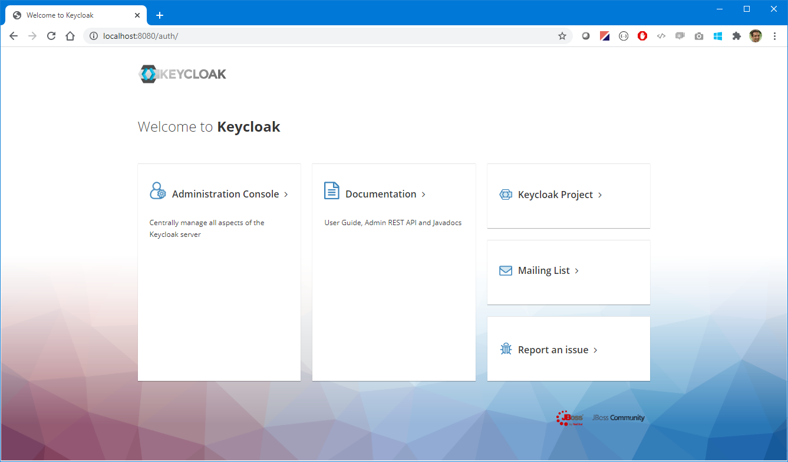
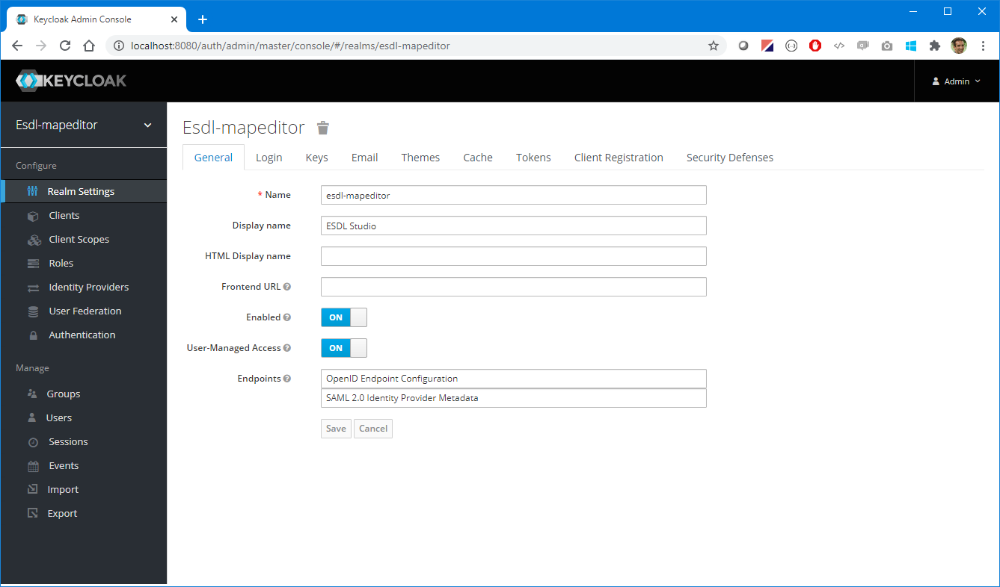
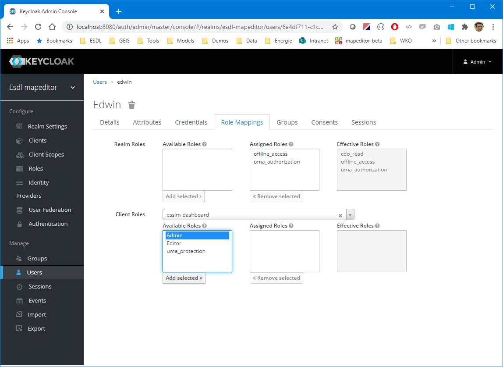

# ESDL MapEditor and ESSIM

This project contains all information necesarry to run the ESDL MapEditor and ESSIM toolsuite on your local machine or cloud infrastructure.

## Contents

- [What can I do with the MapEditor and ESSIM?](#what-can-i-do-with-the-mapeditor-and-essim?)
- [What is ESDL?](#what-is-esdl?)
- [Features](#features)
- [The architecture of the Toolsuite](#the-architecture-of-the-toolsuite)
- [Setting up and running the software stack](#setting-up-and-running-the-software-stack)
  - [Step 1. Starting the software for the base infrastructure](#step-1-starting-the-software-for-the-base-infrastructure)
  - [Step 2. Import the keycloak settings for the MapEditor](#step-2-import-the-keycloak-settings-for-the-mapeditor)
  - [Step 3. Creating user accounts](#step-3-creating-user-accounts)
  - [Step 4. Configure role based access control for ESSIM dashboard](#step-4-configure-role-based-access-control-for-essim-dashboard)
  - [Step 5. Create an API key in Grafana for the Panel Service](#step-5-create-an-api-key-in-grafana-for-the-panel-service)
  - [Step 6. Start the MapEditor and ESSIM](#step-6-start-the-mapeditor-and-essim)
  - [Step 7. Log in to the ESDL MapEditor](#step-7-log-in-to-the-esdl-mapeditor)
  - [Step 8. Upload some profiles](#step-8-upload-some-profiles)
- [ESDL MapEditor and ESSIM Tutorials](#esdl-mapeditor-and-essim-tutorials)
- [Details](#details)
  - [Running services](#running-services)
  - [Default credentials](#default-credentials)
  - [Configuration](#configuration)
- [License](#license)

## What can I do with the MapEditor and ESSIM?

The ESDL MapEditor is a map based energy system editor. You can use it to create ESDL based energy system descriptions, that can then be simulated with a growing number of ESDL capable simulators.
ESSIM is our ESDL based energy system simulator that gives insights in the hourly energy (im)balance of an energy system described in the ESDL language.


To get an impression of what the tools can do and how they look like, have look at the [tutorials](https://github.com/ESDLMapEditorESSIM/essim-tutorials).

## What is ESDL?

ESDL is a modelling language created to describe complete (hybrid) energy systems in one uniform format. It allows to describe information about the individual energy system components, how they are connected, how they are used (e.g. using energy production or consumption profiles), where they are physically located (on the map), what they cost (now and in future). Furthermore information about buildings in an area, energy potential, KPIs (on buildings, areas, or any assets) can be described. Possible applications are facilitating interoperability between different energy transition models and publishing open data on energy systems.

Click [here](https://energytransition.gitbook.io/esdl/) for the ESDL documentation website

Click [here](https://energytransition.github.io/) for the ESDL class documentation website (a clickable ESDL model)

Click [here](https://github.com/EnergyTransition/ESDL) for the ESDL github website

## Features

### ESDL MapEditor Features

- Draw an energy system scenario by dragging and dropping energy assets on a map
- Connect components, set typical component characteristics (installed power, efficiencies, costs)
- Attach power or energy profiles to assets (demand and production profiles)
- Set control strategies (specifically needed for ESSIM simulations)
- Query external ESDL data sources, for example for solar or wind potential
- Visualize WMS layers with information that can be used to define your scenario
- Convert shapefiles into ESDL assets
- Query the boundary service for area borders (provinces, municipalities)
- Visualize results of simulations on the map (KPI dashboards, load animations, color areas based on KPI outcomes, load duration curves)

Click [here](https://energytransition.gitbook.io/esdl/esdl-based-tools/mapeditor) for some more information on the ESDL MapEditor

### ESSIM Features 

- Simulates energy systems defined in ESDL and calculates energy balance over time
- Calculates optimal schedule of flexible producers and the effect of this schedule in terms of emissions, costs, load on the network
- Calculates schedules for conversion and storage in a similar manner

Click [here](https://energytransition.gitbook.io/esdl/esdl-based-tools/essim) for some more information on ESSIM

## The architecture of the Toolsuite

The architecture of the toolsuite provided is shown here (the gray components are open source solutions provided by others):


It consists of the following functionalities:
- ESDL MapEditor: map based scenario editor
- ESSIM: energy system simulator, to calculate hourly energy balance and give insights in effects of conversion and storage
- Identity & Access Management: using keycloak, an open-source IAM solution, it provides user management, roles, groups, organisations, authentication and authorisation, role based access control
- ESDL Drive: cloud storage for ESDL files, with access control at user, group or organisation level (supports versioning in the near future)
- Panel Service: service to create graphs from influxdb time series
- Boundary Service: service that gives boundary information for provinces, municipalities, neighbourhoods, and so on
- Grafana: open-source analytics & monitoring solution for every database
- InfluxDB: open-source time series database solution
- PostgresDB with PostGIS extension: open-source relational database management system 
- MongoDB: open-source document-oriented database program (NoSQL)

## Setting up and running the software stack

Steps to folow
- [Step 1. Starting the software for the base infrastructure](#step-1-starting-the-software-for-the-base-infrastructure)
- [Step 2. Import the keycloak settings for the MapEditor](#step-2-import-the-keycloak-settings-for-the-mapeditor)
- [Step 3. Creating user accounts](#step-3-creating-user-accounts)
- [Step 4. Configure role based access control for ESSIM dashboard](#step-4-configure-role-based-access-control-for-essim-dashboard)
- [Step 5. Create an API key in Grafana for the Panel Service](#step-5-create-an-api-key-in-grafana-for-the-panel-service)
- [Step 6. Start the MapEditor and ESSIM](#step-6-start-the-mapeditor-and-essim)
- [Step 7. Log in to the ESDL MapEditor](#step-7-log-in-to-the-esdl-mapeditor)
- [Step 8. Upload some profiles](#step-8-upload-some-profiles)

### Step 1. Starting the software for the base infrastructure

Start the base infrastructure (databases, grafana, pgadmin, ...)
```
cd BaseInfrastructure
docker-compose up
```

### Step 2. Import the keycloak settings for the MapEditor

Execute the following three commands from the `BaseInfrastructure` directory or follow detailed instructions [here](./BaseInfrastructure/keycloak/README.md)

Copy the configuration in the keycloak container.
```
docker cp keycloak/esdl-mapeditor-realm.json keycloak:/tmp/esdl-mapeditor-realm.json
```

Import the configuration in Keycloak. When the import is successfull and keycloak has started successfully, you can Ctrl-C out of the container.
```
docker exec -it keycloak /opt/jboss/keycloak/bin/standalone.sh -Djboss.socket.binding.port-offset=100 -Dkeycloak.profile.feature.upload_scripts=enabled -Dkeycloak.migration.action=import -Dkeycloak.migration.provider=singleFile -Dkeycloak.migration.strategy=OVERWRITE_EXISTING -Dkeycloak.migration.file=/tmp/esdl-mapeditor-realm.json
```

Restart the container to reload the ESLD-Mapeditor realm:
```
docker-compose restart keycloak
```

### Step 3. Creating user accounts

Using you webbrowser, go to `http://localhost:8080` to open keycloak


Login with the admin credentials as specified in the docker-compose file


Once you're logged in, you should see the following screen


Click `Users` from the menu on the left


Click `Add User` and fill in the proper user credentials and click `Save`


After clicking `Save` a number of tabs appear. Go to the `Credentials` tab and set the password of the newly created user


Go to the `Attributes` tab and add an attribute `role` with value `essim`, press `Add` and press `Save`


### Step 4. Configure role based access control for ESSIM dashboard

The ESSIM dashboard is a Grafana based solution for viewing simulation results. Grafana supports multiple roles: Viewer, Editor and Admin. If you want to give some users other roles then Viewer, add the roles Editor and/or Admin to keycloak and assign these roles to the appropriate user. When you don't do this, all users get the Viewer rights.

Go to the user that needs to become an Editor or Admin, go to the `Role Mappings` tab, at `Client Roles` select `essim-dashboard` and add the Editor or Admin role to the user.


### Step 5. Create an API key in Grafana for the Panel Service

Log in to Grafana, go to `http://localhost:3000` and login with the credentials from the user with Admin rights you've just created.


Select the menu option 'API keys' in the settings menu.


Click the button 'New API key'


Fill in the details for the API key. Choose a name (e.g. 'panel-service') and make sure to give it the 'Admin' role.


Copy the generated API key.


Fill in this API key in the file `.\ESDLMapEditor\panel-service.env` (Replace the key that is already there).
```
GRAFANA_API_KEY=eyJrIjoiV3g0Z3pGUUxBNkhucXlySjhCRFczNXZwVXhiREhrRXciLCJuIjoicGFuZWwtc2VydmljZSIsImlkIjoxfQ==
```

### Step 6. Start the MapEditor and ESSIM

In another terminal window, start ESSIM:
```
cd ESSIM
docker-compose up
```

In yet another terminal window, start the ESDL MapEditor and accompanying services:
```
cd ESDLMapEditor
docker-compose up
```

To start ESDL Drive storage do the following in another terminal (or use -d option for each `docker-compose` command, to start in detached mode):
```
cd ESDLDrive
docker-compose up
```

### Step 7. Log in to the ESDL MapEditor

Using your webbrowser go to `http://localhost:8111`


Press `Start` and log in using the credentials created in the previous step


You should see the following screen now:


### Step 8. Upload some profiles

If you're installing this toolsuite to run ESSIM simulations or any other application that requires timeseries data, you need to upload some profiles. For that purpose we've created a profile manager. In the repository there is an example dataset with profiles created from publically available data (NEDU profiles for electricity and gas usage and KNMI solar profile). 

Click `View` and select `Settings` from the menu. The application settings dialog appears. Click `Upload profiles`.


Drag the file `.\Data\Profiles\standard_profiles_point.csv` and drop it in the area indicated in the dialog. Depending on your local machine's regional settings (Use '.' or ',' as the decimal seperator) you might need to choose the other csv file in the same directory.


After the uploading is finished, click `Profiles plugin` in the menu on the left. On the right side a window appears where you can view and edit the settings of the profiles you've just uploaded.


The profiles can now be used in the simulations.

## ESDL MapEditor and ESSIM Tutorials
Please go [here](https://github.com/ESDLMapEditorESSIM/essim-tutorials) to find five different tutorials that explain how to work with the ESDL MapEditor and ESSIM

## Details

### Running services

| Service | Port | Environment variable |
| --- | --- | --- | 
| MapEditor | 8111 | MAPEDITOR_PORT |
| Grafana | 3000 | GRAFANA_PORT |
| Keycloak | 8080 | KEYCLOAK_PORT |
| PGAdmin | 5050 | PGADMIN_PORT |

| Service | Port | Environment variable |
| --- | --- | --- | 
| Mongo | 27017 | MONGO_PORT |
| InfluxDB | 8086 | INFLUXDB_PORT |
| PostgresDB | 5432 | POSTGRES_PORT |

| Service | Port | Environment variable |
| --- | --- | --- |
| ESDL Drive | 9080 | - |
| ESDL Drive | 9443 (SSL-port) | - |

### Default credentials

| Service | User | Password | Configured in | Comment |
| --- | --- | --- | --- | --- |
| Keycloak | admin | admin | docker-compose.yml | |
| Grafana | admin | admin | docker-compose.yml | |
| InfluxDB | admin | admin | docker-compose.yml | |
| PostgresDB | postgres | password | docker-compose.yml | | 
| PostgresDB | keycloak | password | init-database.sh | | 
| PostgresDB | boundary_service | password | init-database.sh | | 
| PostgresDB | drive | password | init-database.sh and ESDLDrive/docker-compose.yml | |
| PGAdmin | admin@admin.org | admin | docker-compose.yml | |


### Configuration

#### InfluxDB

...

#### PostgresDB

The file `.\BaseInfrastructure\postgres\init-databases.sh` contains the initialization script for the postgres database.

#### ESDL Drive

ESDL Drive exists of 3 components: ESDL Drive (API), CDO-Server (ESDL -> Relational database mapper) and Postgres (Database).
ESDL Drive uses the Postgres database for storage of ESDL files. CDO-Server must be configured with the correct credentials to connect to Postgres database from the base infrastructure. This can be done in the `docker-compose.yml` of ESDLDrive. The database and 'drive' account are created in the `init-databases.sh` script

ESDL Drive (API) is secured by KeyCloak and needs some configuration, among others the URL of the ESDL-Mapeditor realm (both internal as external accessible by the browser). This is configuration is defined in `ESDLDrive/docker-compose.yml`. Environment variables defined in the YML file are used in `server.xml` which configures the Open Liberty server that is packaged in the container in `/servers/hub`. 

ESDL Drive also needs the public key of the ESDL-Mapeditor realm, to verify the JWT tokens from Keycloak. For this setup the public key is already added in the `public.p12` keystore, but if it is changed, edit the file in `/server/hub/resources/security/public.p12` with the Java `keytool`.


...

Users/Password/Database

## License

MapEditor and ESSIM are distributed under the [Apache 2.0 License](http://www.apache.org/licenses/LICENSE-2.0).
